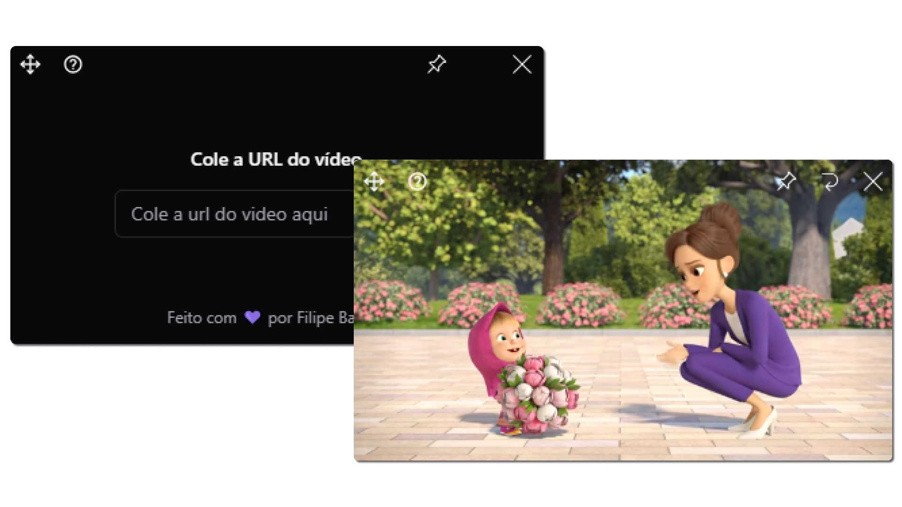

# Indice

- [Sobre](#-sobre)
- [Tecnologias](#Tecnologias)
- [Instalação](#Instalação)

## 🔖&nbsp; Sobre

Aplicativo para assistir videos do youtube sobre outras telas.

## Objetivo

Criei este app para poder assistir videos enquanto trabalhava e aprender mais sobre o desenvolvimento de aplicações usando electron, typescript e tailwind css.
 
---
## Tecnologias

Esse projeto foi desenvolvido com as seguintes principais tecnologias:

- [React JS](https://legacy.reactjs.org/docs/getting-started.html)
- [TailwindCSS](https://tailwindcss.com/)
- [Typescript](https://www.typescriptlang.org/)
- [Electron-Vite](https://electron-vite.org/)

e mais...

---

## [Download](.github/youtube-floating-1.0.0-setup.exe)

---
## Instalação

```bash
$ npm install
```

### Desenvolvimento

```bash
$ npm run dev
```

### Gerar executaveis

```bash
# For windows
$ npm run build:win

# For macOS
$ npm run build:mac

# For Linux
$ npm run build:linux
```

---

<h3 align="center" >Vamos nos conectar 😉</h3>
<p align="center">
  <a href="https://www.linkedin.com/in/filipeleonelbatista/">
    
  </a>&ensp;
  <a href="mailto:filipe.x2016@gmail.com">
    
  </a>&ensp;
  <a href="https://instagram.com/filipeleonelbatista">
    
  </a>
</p>
<br />
<p align="center">
    Desenvolvido 💜 por Filipe Batista 
</p>