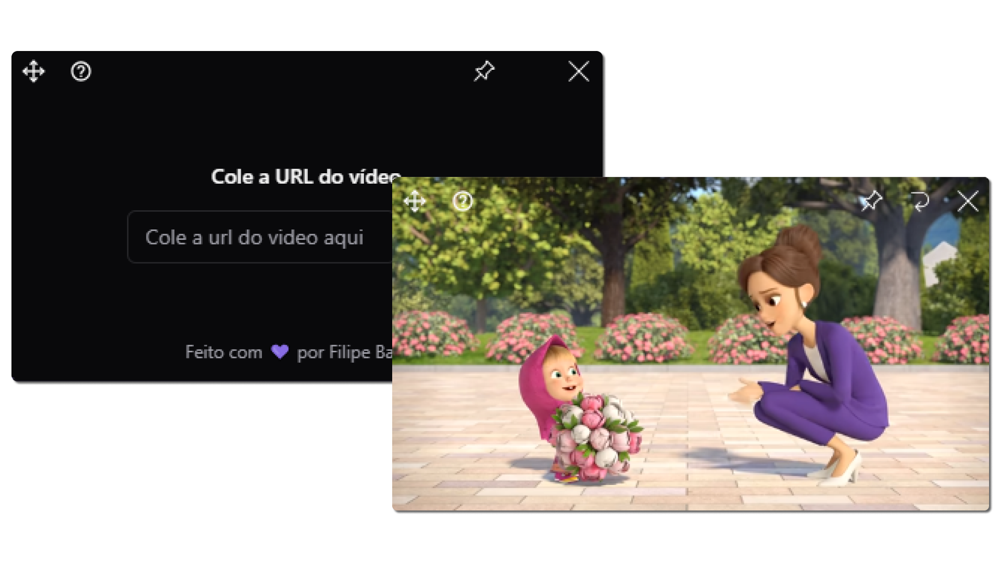

<a href="https://github.com/filipeleonelbatista/youtube-floating/blob/master/README.md" target="_blank">
  
  Version in Brasilian Portuguese
</a>
</br>
</br>



# Index

- [About](#-about)
- [Technologies](#technologies)
- [Installation](#installation)

## 🔖&nbsp; About

An application to watch YouTube videos on top of other screens.

## Objective

I created this app to be able to watch videos while working and learn more about developing applications using Electron, TypeScript, and Tailwind CSS.
 
---
## Technologies

This project was developed with the following main technologies:

- [React JS](https://legacy.reactjs.org/docs/getting-started.html)
- [TailwindCSS](https://tailwindcss.com/)
- [Typescript](https://www.typescriptlang.org/)
- [Electron-Vite](https://electron-vite.org/)

and more...

---

## [Download](.github/youtube-floating-1.0.0-setup.exe)

---
## Installation


```bash
$ npm install
```

### Development

```bash
$ npm run dev
```

### Generate executables

```bash
# For windows
$ npm run build:win

# For macOS
$ npm run build:mac

# For Linux
$ npm run build:linux
```

---

<h3 align="center">Let's connect 😉</h3>
<p align="center">
  <a href="https://www.linkedin.com/in/filipeleonelbatista/">
    
  </a>&ensp;
  <a href="mailto:filipe.x2016@gmail.com">
    
  </a>&ensp;
  <a href="https://instagram.com/filipeleonelbatista">
    
  </a>
</p>
<br />
<p align="center">
    Developed 💜 by Filipe Batista 
</p>

